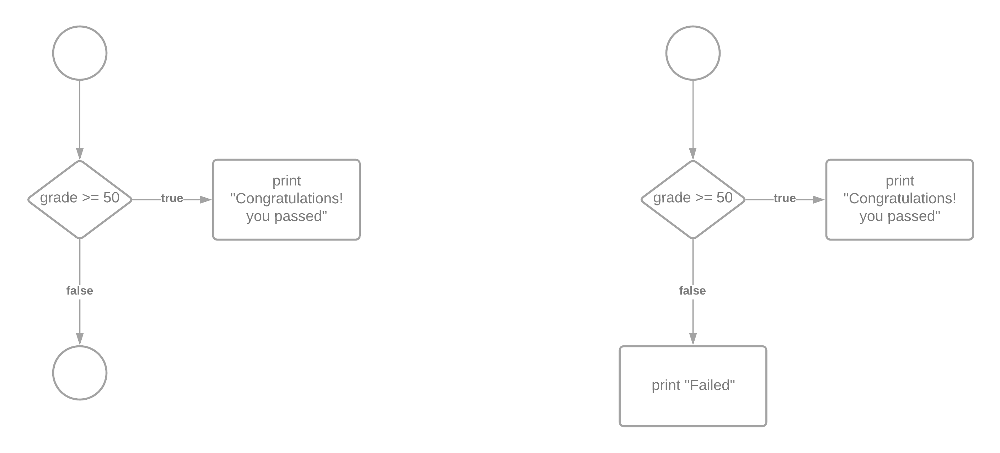

# Conditional Statements and Execution Flow for Conditional Statements

- Conditionals or conditional statements are programming language commands for handling decisions. 
- e.g. to determine if a student's grade is greater than or equal to 50 and whether the program should print "Congratulations! You passed"

## Simple if statement

A simple if statement is written as shown below:

```

if(grade >= 50)
{
  printf("\n Congratulations! You passed");
}

```

- Suppose the value in grade is 60, then the condition grade >= 50 will evaluate to true, and the message **Congratulations! You passed** will be displayed
- However if the value in grade is 40, then the condition grade >= 50 will evaluate to false, and the message will not be displayed.

- [See this program for a complete example of using simple if statement](../src/simpleif.c) 

## if else 

- if else selection statement allows to specify different actions to be performed when the condition is true and when it is false.

- e.g. the following code will display message **Congratulations! You passed** if the condition is true, otherwise it will display message **Failed**.


```
if(grade >= 50)
{
  puts("Congratulations! You passed");
}
else
{
	puts("Failed");
}
```

### Flow chart single selection if vs if else



## Conditional operator ?: | Ternary operator

- C provides the Conditional operator `?:` which is closely related to the if else statement
- it takes three operands
- the 1st operand is the condition
- 2nd operand is the value if the condition is true
- 3rd operand is the value if the condition is false
- [C program using ternary operator](../src/ternaryoperator.c)


