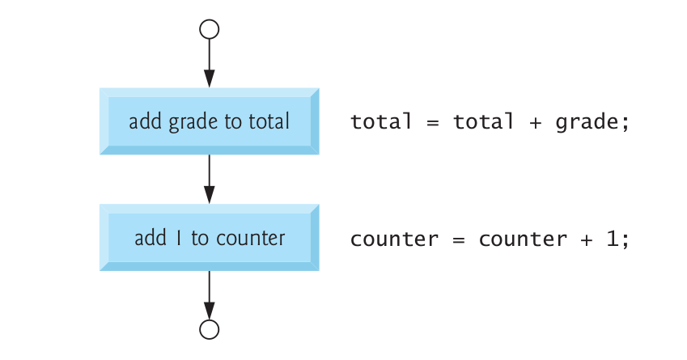

**NOTE: Following content has been taken from the book C How to Program by Paul Deitel and Harvey Deitel**

# Introduction to Algorithms

- The solution to any computing problem involves executing a series of actions in a specific order. A procedure for solving a problem in terms of
1. the actions to be executed, and  
2. the order in which these actions are to be executed  
is called an algorithm.  

- Specifying the order in which statements are to be executed in a computer program is called **program control**

- **Pseudocode** is an artificial and informal language that helps you develop algorithms.

## Flowcharts

- A flowchart is a graphical representation of an algorithm or of a portion of an algorithm.
- Flowcharts are drawn using certain special-purpose symbols such as:
  - rectangles
	- diamonds
	- rounded rectangles, and
	- small circles
- these symbols are connected by arrows called flowlines.

- Like pseudocode, flowcharts are useful for developing and representing algorithms, although pseudocode is preferred by most programmers. 
- Flowcharts clearly show how control structures operate.

- When drawing a flowchart that represents a complete algorithm, a rounded rectangle symbol containing the word **Begin** is the first symbol used in the flowchart; 
- a rounded rectangle symbol containing the word **End** is the last symbol used. 

- When drawing only a portion of an algorithm as in Figure above, the rounded rectangle symbols are omitted in favor of using small circle symbols, also called connector symbols.
- Perhaps the most important flowcharting symbol is the diamond symbol, also called the decision symbol, which indicates that a decision is to be made.

