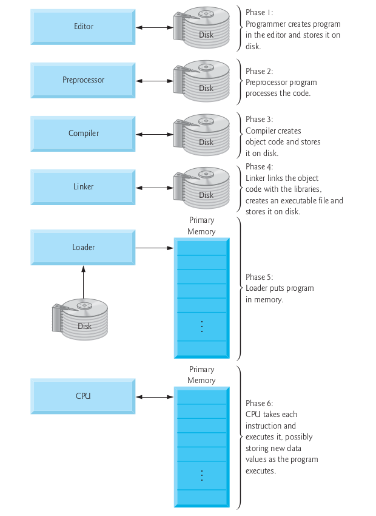

# Phases a c program passes through

- Modern Integrated Development Environments(IDEs) e.g. CodeBlocks allow us to do many things in one place, e.g. example it allows all the functionalities of an editor such as notepad  
- When we click the Build and Run button or press an equivalent shortcut from the keyboard our program called the source code passes through many stages and is finally transformed into executable form

## Preprocessor

The preprocessor takes the preprocessor directive and interprets it. For example, if `#include<stdio.h>` directive is present in the program, then the preprocessor interprets the directive and replace this directive with the content of the `stdio.h` file.

## Compiler
Compiler creates the object code.

## Linker
Linker links the object code with the libraries and creates an executable file.

## Loader
Loader puts the program in memory

## Execution
CPU takes each instruction and executes it.

**Note: the image above has been taken from the book C how to program by deitel and deitel 5th edition**

