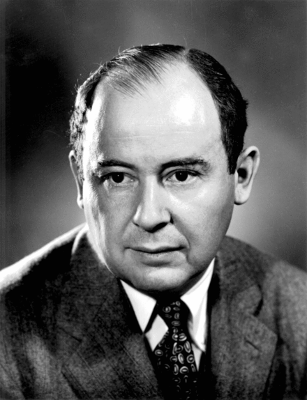
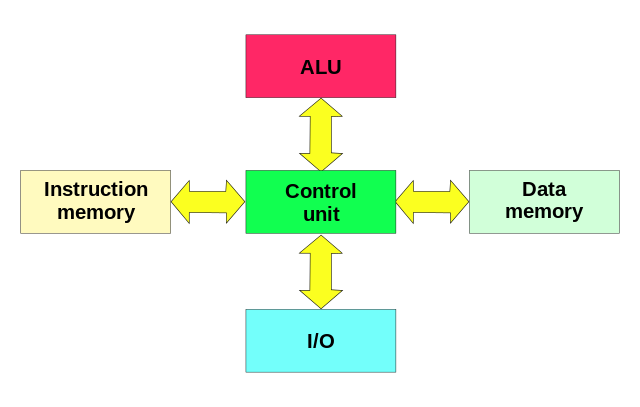

**Note: images and contents presented here have been taken from wikipedia.org. Questions presented here were responded by chatGPT**

# John Von-Neumann 

- Before we talk about the architecture let us know a bit about Von-Neumann.
- [Von-Neumann](https://en.wikipedia.org/wiki/John_von_Neumann ) is regarded as the foremost mathematician of his time. 
- He made major contributions to many fields, including mathematics, physics, economics, computing, and statistics.
- When he was six years old he could divide two 8 digit numbers in his head!!! 

## Von-Neumann Architecture

- Also known as Princeton architecture is a computer architecture based on a 1945 description by John von Neumann.
- The Von-Neumann architecture for an electronic digital computer has following components:

1. A processing unit that contains arithmetic logic unit and processor registers
2. A control unit that contains an instruction register and program counter
3. Memory that stores both data and instructions
4. External mass storage
5. Input and output mechanisms.

- This architecture refers to any stored-program computer in which an instruction fetch and a data operation cannot occur at the same time because they share a common bus.

## Related topics

- Harvard architecture has one dedicated set of address and data buses for reading and writing to memory and another set of address and data buses to fetch instructions

**Question: Why Von Neumann architecture is significant?**

**Response:**

Von Neumann architecture is significant for several reasons:

1. **Foundation of Modern Computing**: It laid the groundwork for the design of modern computers. This architecture separates the CPU, memory, and input/output devices, allowing for the execution of stored program instructions. This concept is fundamental to all general-purpose computers today.

2. **Programmability**: Von Neumann architecture introduced the concept of stored-program computers, where both data and instructions are stored in the same memory. This allows for flexibility in programming and executing various tasks without the need for hardware modifications.

3. **Efficiency**: By storing instructions in memory, the CPU can fetch and execute them sequentially, making the operation more efficient compared to earlier designs where instructions were hardwired. This architecture facilitates faster computation and easier modification of programs.

4. **Versatility**: Von Neumann architecture allows for the development of versatile and programmable computers capable of performing a wide range of tasks. It's not limited to specific applications and can be adapted for various purposes through software programming.

5. **Standardization**: The Von Neumann architecture provided a standardized model for computer design, leading to compatibility and interoperability among different computer systems. This standardization has been crucial for the widespread adoption and evolution of computing technology.

Overall, the Von Neumann architecture forms the basis of modern computing systems, enabling the development of powerful, programmable, and versatile machines that have revolutionized almost every aspect of our lives.

**Question: Which architecture computers followed before Von Neumann Architecture?**

**Response:**

Before the Von Neumann architecture, computers followed various architectures, including:

1. **Harvard Architecture**: In the Harvard architecture, separate memory units are used to store program instructions and data. This architecture allows for simultaneous access to both instructions and data, which can enhance performance in certain applications. However, it can be more complex to implement compared to the Von Neumann architecture.

2. **Fixed-Program Computers**: Early computers, such as the ENIAC (Electronic Numerical Integrator and Computer), were fixed-program computers. They were designed to perform specific tasks and were not programmable in the way modern computers are. These computers had their instructions hardwired into their circuitry and were not capable of storing and executing general-purpose programs.

3. **Stored-Program Computers (Pre-Von Neumann)**: There were some early attempts at stored-program computers before the Von Neumann architecture became predominant. For example, the Manchester Baby (Small-Scale Experimental Machine), developed in the late 1940s, demonstrated the concept of storing both instructions and data in memory. However, these early stored-program computers lacked the full architectural features and principles that define the Von Neumann architecture.

4. **Other Experimental Architectures**: Various experimental architectures were explored before the Von Neumann architecture became standardized. These included different ways of organizing memory, processing units, and input/output mechanisms. Many of these early architectures were not as efficient or versatile as the Von Neumann architecture.

Overall, the Von Neumann architecture emerged as the most influential and widely adopted architecture due to its simplicity, efficiency, and flexibility, but before its dominance, several alternative architectures were explored and implemented in early computer designs.

**Question: What does the term architecture mean when used in the context of computers?**

**Response:**

In the context of computers, "architecture" refers to the fundamental design principles and organization of a computer system. It encompasses the structure and arrangement of its components, including the CPU (Central Processing Unit), memory, input/output devices, and the interconnections between them.

Computer architecture defines how data is processed, stored, and transferred within the system. It includes specifications such as the instruction set architecture (ISA), which outlines the set of instructions that the CPU can execute, as well as the organization of memory, addressing modes, and input/output mechanisms.

Computer architects design and optimize computer systems to meet specific performance, power consumption, cost, and reliability requirements. Different architectures can vary significantly in terms of their complexity, performance characteristics, and suitability for specific applications.

Key aspects of computer architecture include:

1. **Instruction Set Architecture (ISA)**: Defines the set of instructions that the CPU can execute and the format of these instructions.

2. **Memory Hierarchy**: Organizes memory into different levels, such as registers, cache, main memory (RAM), and secondary storage (disk or SSD), to optimize performance and cost.

3. **CPU Organization**: Specifies the structure of the CPU, including the number and type of execution units, pipelining, and caching mechanisms.

4. **Input/Output System**: Describes how data is transferred between the computer and external devices, including interfaces, protocols, and controllers.

5. **Parallelism and Concurrency**: Addresses how multiple tasks or instructions can be executed simultaneously to improve performance, including concepts such as multi-core processors, vector processing, and parallel computing architectures.

Computer architecture is a foundational concept in computer science and engineering, shaping the design and development of hardware systems and influencing the performance and capabilities of computing devices.

