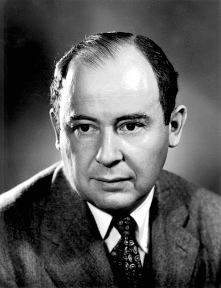
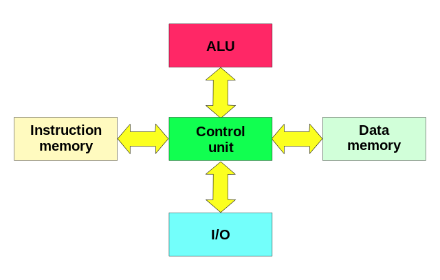

**Note: images and contents presented here have been taken from wikipedia.org**

# John Von-Neumann 

- Before we talk about the architecture let us know a bit about Von-Neumann.
- [Von-Neumann](https://en.wikipedia.org/wiki/John_von_Neumann ) is regarded as the foremost mathematician of his time. 
- He made major contributions to many fields, including mathematics, physics, economics, computing, and statistics.
- When he was six years old he could divide two 8 digit numbers in his head!!! 

## Von-Neumann Architecture

- Also known as Princeton architecture is a computer architecture based on a 1945 description by John von Neumann.
- The Von-Neumann architecture for an electronic digital computer has following components:

1. A processing unit that contains arithmetic logic unit and processor registers
2. A control unit that contains an instruction register and program counter
3. Memory that stores both data and instructions
4. External mass storage
5. Input and output mechanisms.

- This architecture refers to any stored-program computer in which an instruction fetch and a data operation cannot occur at the same time because they share a common bus.

## Related topics

- Harvard architecture has one dedicated set of address and data buses for reading and writing to memory and another set of address and data buses to fetch instructions

